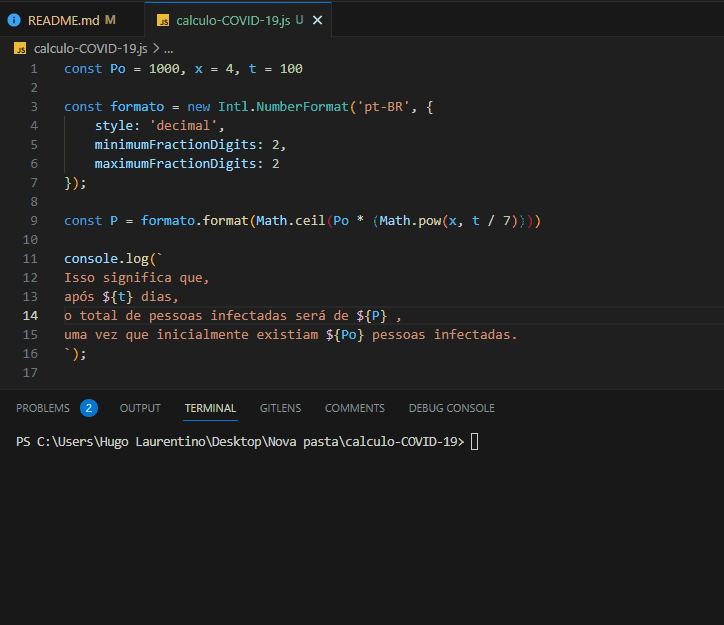

<h1 align="center">
  
</h1>


- [x] Bak-End
- [x] Criar Título
- [x] Criar Descrição
- [x] Sobre
- [x] Tecnologia
- [x] Pre requisito
- [x] Autor
- [x] GIF‘s
---
<h1 align='center'>Calculo-COVID-19</h1>

<p align='center'>Esse é um exemplo de logica em javascript</p>
<p align='justify'>Suponha que você está trabalhando no Ministério da Saúde e está trabalhando num simulador de casos de COVID-19. Seu trabalho é fazer um programa que calcula qual será o total de pessoas infectadas a partir de 3 variáveis.</p>

<p align='center'>
	<a href='#sobre'>Sobre</a> |
	<a href='#pré-requisitos'>Pre Requisitos</a> |
	<a href='#tecnologias'>Tecnologias</a> |
	<a href='#autor'>Autor</a>
</p>

---
<h1 align='center'>
	
</h1>

---
### Sobre
  <p align= 'justify'>
O seu sistema ira calcular quantas pessoas estarão infectadas após 100 dias, dado que inicialmente havia 1000 pessoas infectadas, cada uma delas transmitindo para outras 4 pessoas.


 Para isso, utiliza-se a fórmula seguinte:

$$ P = Po \ * x ^\frac{t}{7} $$

Onde o:
**P =** total de pessoas
**Po =** a população incial de pessoas infectadas \
**X =** quantidade de pessoas para as quais um paciente infectado pode transmitir \
**t =** tempo percorrido
 ___
Ou seja, se:

**Po =** 1000 \
**x =** 4 \
**t =** 100


P será a quantidade de pessoas infectadas após decorrido o tempo t. Imprima na tela o valor de P para os dados informados acima.
  </p>


---
### Pré-requisitos 

Antes de começar, você vai precisar ter instalado em sua máquina as seguintes FERRAMENTAS: [GIT](https://git-scm.com/), [Node.js](https://nodejs.org/en/download). 
Além disto é bom ter um editor para trabalhar com o código como [VSCode](https://code.visualstudio.com/download).

### 🎲 Rodando o Back End

```bash
# Clone este repositório
$ git clone https://github.com/hugolaurentino/calculo-COVID-19.git

# Acesse a pasta do projeto no terminal/cmd
$ cd calculo-COVID-19

# Instale as dependências
$ npm install

# Execute 
$ node .\calculo-COVID-19.js

```
### Tecnologias 

As seguintes ferramentas foram usadas na construção do projeto:

- [Node.js][nodejs]
---

## Autor

Feito com ❤️ por Hugo Laurentino 👋🏽 [Entre em contato!](https://www.linkedin.com/in/hugo-laurentino-silva/)

[nodejs]: https://nodejs.org/